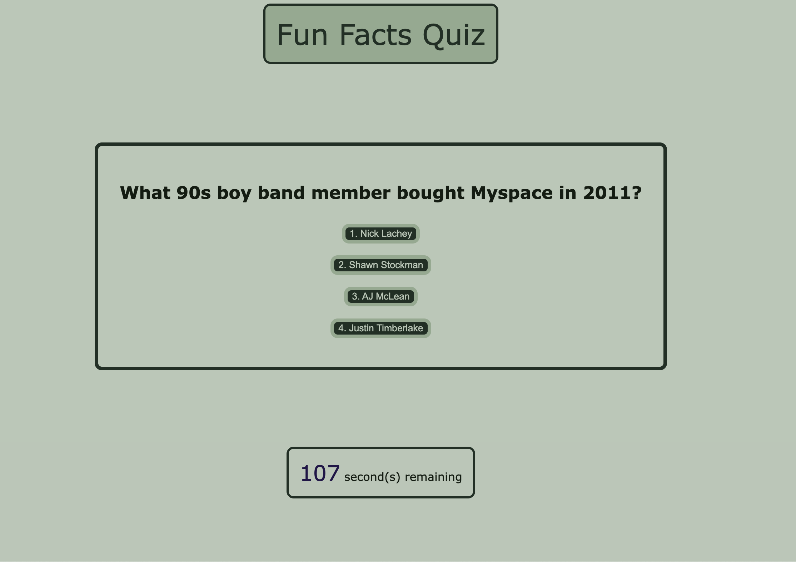

# Fun Facts Quiz!

#### Quiz contains:
* 15 multiple choice questions (answer key at the bottom of this file)
    * If you are correct, you can move on to the next question
    * If you are not correct, ten seconds will be taken from the timer.
* A timer set to start at 120 seconds. 
* A scoreboard at the end where a user can choose to save their score, or play again.
* A separate window that shows the top scores in order of highest score.

[Link to deployed GitHub Pages](https://lrltillman.github.io/facts-quiz/)

#### Screenshot of quiz:

### Assisted by Sandy Smith and Suresh Kumar. 

### Fun facts sourced from: https://travelswithelle.com/other/multiple-choice-trivia-questions/

Answer Key:
1. Justin Timberlake
2. Liver
3. Atlantic Ocean
4. 200
5. Pokemon
6. Fungi
7. Smallpox
8. Octopus
9. Austria
10. Mosquitos
11. Peanut Butter
12. Seaweed
13. New Zealand
14. Poodle
15. Home Alone